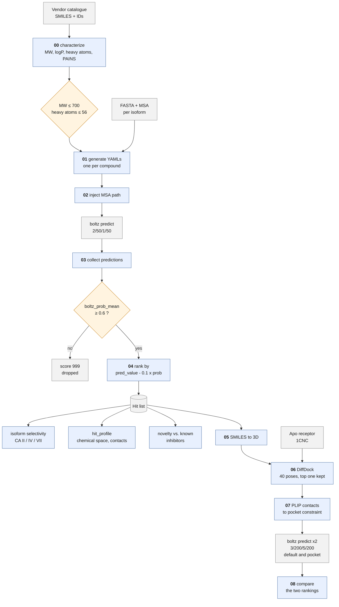
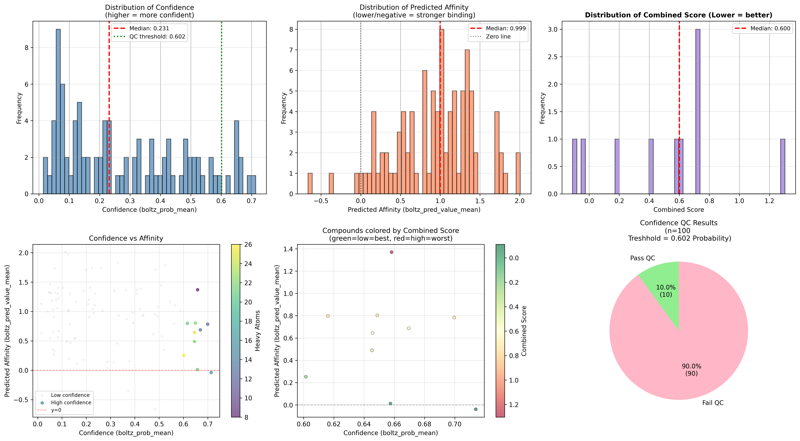
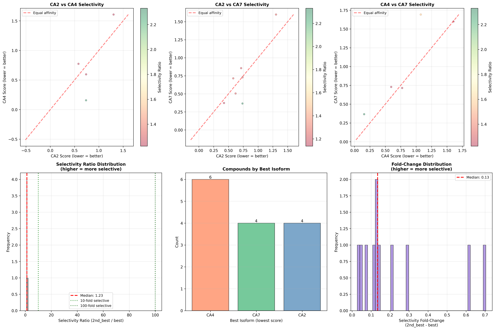
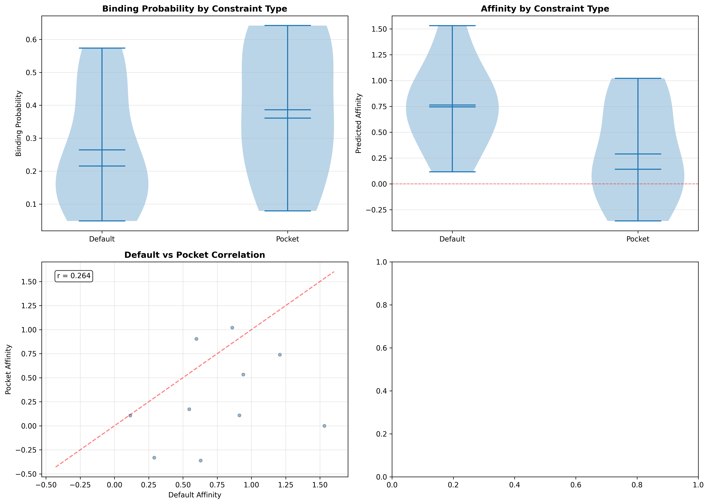

# Boltz-2 MolPort Screening

Prospective virtual screening of a commercial compound catalogue against human
carbonic anhydrase isoforms (CA II, CA IV, CA VII) with **Boltz-2**, followed by
constraint-based re-ranking with DiffDock and PLIP.



`run_screening.sh` covers the upper half, `run_constraints.sh` the lower.

## What this is built for, and what else it does

The pipeline was written for one job: take a **MolPort catalogue of purchasable
small molecules**, predict binding affinity against a target, and rank the
catalogue so that the top of the list can be ordered and tested. Everything is
shaped around that — MolPort IDs as the compound key, a size filter matched to
Boltz-2's affinity module, a two-stage score that discards low-confidence
predictions rather than trusting a strong number, and a re-ranking stage that
asks whether interaction constraints change the order.

None of it is locked to that job. The input is a CSV: any SMILES column, any ID
column, any source. The target is a FASTA plus an alignment, so any protein
works. The three carbonic anhydrase isoforms are entries in a config, not
assumptions in the code. Screening a different vendor catalogue against a
different target means editing
[`screening/screening_config.yaml`](screening/screening_config.yaml) and nothing
else.

What the pipeline does *not* do is decide what a good hit is. It ranks by
predicted affinity under a confidence filter; whether that ranking means
anything for your target is a question the [DUD-E benchmark
repository](https://github.com/NikMibu/boltz2-dude-benchmark) addresses and this
one does not.

## Contents

| | |
|---|---|
| [`screening/`](screening/) | Dataset characterization, YAML generation, MSA injection, Boltz-2 inference, ranking, isoform selectivity |
| [`constraints/`](constraints/) | DiffDock poses, PLIP contacts, constrained re-scoring |
| [`analysis/`](analysis/) | Novelty, property comparison and structural profiling of a hit list |
| [`data/`](data/README.md) | Target sequences, alignments, apo receptor, ChEMBL reference set, demo compounds |
| [`results/example/`](results/example/README.md) | Input and output formats, produced from the demo set |
| `validate_setup.py` | Checks Boltz-2, micromamba, DiffDock, PLIP and the FASTA/MSA pairing before a long run |
| [`SMOKE_TEST.md`](SMOKE_TEST.md) | End-to-end check from a fresh clone, with the traps |

> **No screening results are published here.** The predictions, rankings and hit
> lists produced during the thesis are not part of this repository. What ships
> is the code and a 100-compound demo set so that both pipelines can be run
> without a library of your own — see [`data/demo/`](data/demo/README.md).

## What it produces

Everything below came from the shipped demo set: 100 arbitrary catalogue
compounds against hCA II, hCA IV and hCA VII. **Not a screening result** — the
compounds were not selected and the ranking says nothing about carbonic
anhydrase. It is what the output looks like.



Binding probability, predicted affinity and combined score across the set, plus
the confidence-vs-affinity plane the two-stage score cuts through. Ten of the
100 clear the QC threshold — an untargeted sample of natural products screened
against one enzyme mostly should not.



Score agreement and selectivity across the three isoforms. With 100 compounds
this is a demonstration of the analysis, not a finding; the statistics need a
library.



The same compounds predicted twice, once free and once held to the pocket
contacts PLIP found in the DiffDock pose. Whether that changes the order is the
question [`run_constraints.sh`](run_constraints.sh) exists to answer.

More, including what each number does and does not mean, in
[`results/example/`](results/example/README.md).

## Screening

```bash
# check the wiring: five compounds, one isoform, no GPU
bash run_screening.sh --target ca2 --limit 5 --skip-boltz

# five compounds through the GPU at reduced parameters, minutes
bash run_screening.sh --target ca2 --smoke

# the demo set against all three isoforms, end to end
bash run_screening.sh --target all

# your own catalogue
python3 screening/00_characterize_dataset.py --input mine.xlsx --out-dir data/
bash run_screening.sh --target ca2 --input data/mine_properties.csv
```

The wrapper runs YAML generation → MSA injection → `boltz predict` → prediction
collection → ranking, per target. It answers `--help`, takes `--config`, and
exits 2 on an unknown flag. Boltz-2 is taken from `$BOLTZ_EXE` if set, otherwise
`boltz` on the `PATH`.

**The input is yours to supply.** No compound library ships with this
repository. Any CSV with a SMILES column and an ID column works; the columns
are named in the config or auto-detected.

### Scoring

Two stages, both configurable in
[`screening/screening_config.yaml`](screening/screening_config.yaml):

1. **Quality control** — a compound must reach `boltz_prob_mean >= 0.6`.
   Compounds below it receive the sentinel score 999 and drop out of the
   ranking. A strong predicted affinity does not rescue a low-confidence
   prediction.
2. **Ranking** — `combined_score = boltz_pred_value_mean - 0.1 * boltz_prob_mean`,
   **lower is better**.

Before either stage, compounds above 56 heavy atoms or 700 Da are filtered out:
Boltz-2's affinity module is not recommended beyond that size.

> The argparse default inside `04_analyze_ligand_predictions.py` is `0.5`, not
> `0.6`. The wrapper always passes the configured value. Running the script
> directly without `--confidence-threshold` will not reproduce the published
> counts.

### Inference parameters

The prospective screen uses **2/50/1/50** — recycling steps, sampling steps,
affinity recycling steps, affinity sampling steps. These are *reduced* settings,
not the Boltz-2 defaults of 3/200/5/200: a library of ~9,000 compounds against
three isoforms is not affordable at the defaults. The constraint re-ranking of
the top 100 does use the defaults.

Reduced sampling costs pose quality. That is acceptable when the output is an
affinity ranking, and not acceptable when the output is an RMSD — see the
[sister repository](https://github.com/NikMibu/plip_constraints_pipeline) for
what happens to pose accuracy at low sampling.

### Targets

| Key | Isoform | Sequence |
|---|---|---|
| `ca2` | hCA II | P00918, 260 aa |
| `ca4` | hCA IV | P22748 **mature**, 266 aa — signal peptide and GPI-anchor signal trimmed |
| `ca7` | hCA VII | P43166, 264 aa |

Once all three are ranked, `screening/analyze_isoform_selectivity.py` compares
the rank lists; `screening/14_plot_boltz_structure_quality.py` compares the
structural confidence metrics across targets. Both take file paths and ship no
data of their own.

Adding a fourth target means adding a FASTA, an alignment built from that exact
sequence, and four lines in the config. `validate_setup.py` checks that the two
belong together.

## Constraint re-ranking

Does telling Boltz-2 *where* the ligand binds change which compounds come out on
top? The second pipeline docks each hit with DiffDock, reads the contacts of the
top-ranked pose with PLIP, writes them back as a Boltz-2 pocket constraint, and
re-predicts every compound twice — once unconstrained, once constrained.

```bash
cp constraints/config.example.yaml constraints/config.yaml
python3 validate_setup.py                       # DiffDock, PLIP, Boltz-2
bash run_constraints.sh --smoke                 # 10 compounds, minutes
bash run_constraints.sh                         # the real thing
```

| Stage | Script |
|---|---|
| SMILES → 3D conformer | `05_prepare_ligands_for_diffdock.py` |
| DiffDock, 40 poses, top one kept | `06_run_diffdock.py` |
| PLIP contacts → two YAMLs per compound | `07_generate_constraint_yamls.py` |
| Compare the two rankings | `08_analyze_constraint_predictions.py` |

`constraints/cif_to_pdb.py` opens up the other direction. Boltz-2 writes
predicted complexes as mmCIF; PDB is what the tools downstream of it want — a
structure viewer such as ChimeraX or PyMOL to inspect a pose, or PLIP to profile
one. PDB allows a single character per chain, and Boltz names the ligand chain
after the YAML ligand id, so without renaming the ligand is dropped and you are
left looking at a bare protein.

Inference here runs at **3/200/5/200**, the Boltz-2 defaults — not the reduced
settings of the screening stage. A hundred compounds can afford what nine
thousand cannot.

Two external tools are needed that the screening pipeline does not use, and
neither is reliably on the `PATH`:

```bash
export DIFFDOCK_HOME=/path/to/DiffDock
export MAMBA_EXE=/path/to/bin/micromamba   # micromamba installs as a shell
                                           # function; subprocess cannot call it
```

`--smoke` cuts the input to 10 compounds, DiffDock to 4 poses and inference to
1/10/1/10. That proves the chain runs and nothing else — at reduced sampling the
poses are not trustworthy, so no conclusion about constraints should be drawn
from a smoke run.

## Analyses

All four take the hit list as an argument. None of them ship one.

```bash
# Structural novelty: max Tanimoto against known hCA II inhibitors
python analysis/novelty_check.py --hits my_hits.csv --out-dir results/

# Exact SMILES matches against the same reference set
python analysis/smiles_overlap_check.py --hits my_hits.csv

# Heavy-atom distribution: hits vs. known inhibitors vs. full library
python analysis/heavy_atom_comparison.py --hits my_hits.csv --out-dir results/

# Chemical space, internal diversity, and shared pocket contacts
python analysis/hit_profile.py --hits my_hits.csv --out-dir results/ \
    --plip-dir results/constraints/ca2/plip        # PLIP part is optional
```

`hit_profile.py` answers the two questions worth asking about a ranking before
ordering anything. **Are these one scaffold or many?** — Morgan fingerprints,
a PCA map, and each hit's Tanimoto to its nearest neighbour *within the list*.
A list whose nearest-neighbour similarities sit near 1.0 is the scoring function
rewarding one motif. **Do they bind the same way?** — a compound-by-residue
contact matrix from the PLIP reports. On the hCA II top 100 of this project the
answer was Leu198, Phe131, Thr200 and Thr199 in 63–80 % of compounds, the
canonical hydrophobic wall and gatekeeper residues of the site.

`novelty_check.py` reports how many hits fall below a Tanimoto of 0.3 to every
known inhibitor — the operational definition of "structurally novel" used
throughout. `heavy_atom_comparison.py` checks that the hits occupy the same
size range as known binders; a hit list that drifts to much larger molecules is
usually an artefact of the scoring function rather than a discovery.

Every script answers `--help`.

## Input formats

**Hit list** (`--hits` / `--your-hits-csv`) — CSV with at least a `smiles` or
`SMILES` column. A score column is picked up automatically if one of
`boltz_pred_value_mean`, `pred_score`, `prediction_score` is present, or can be
named with `--score-col`; it is only used for the novelty-vs-score plot.

**Reference set** (`--known`) — CSV with a `smiles` column. Defaults to
[`data/reference/known_ca2_inhibitors.csv`](data/reference/README.md).

## Requirements

```bash
python3 -m venv .venv && source .venv/bin/activate
pip install -r requirements.txt
python3 validate_setup.py
```

Python 3.10. The analyses need no GPU; both pipelines do. `requirements.txt`
pins the versions of the published run and explains why two of them matter.
Boltz-2, DiffDock and PLIP are not installed by it — see the notes at the
bottom of that file and [`SMOKE_TEST.md`](SMOKE_TEST.md).

## Related repositories

This is one of three from the same work. Each answers a different question about
the same model and target.

| | |
|---|---|
| [`boltz2-dude-benchmark`](https://github.com/NikMibu/boltz2-dude-benchmark) | **Can the ranking be trusted?** Retrospective validation on DUD-E: 492 known hCA II actives against 31,172 property-matched decoys, classification and regression metrics. |
| **this repository** | **What does it find?** Prospective screening of a vendor catalogue against three isoforms, and whether interaction constraints change the order. |
| [`plip_constraints_pipeline`](https://github.com/NikMibu/plip_constraints_pipeline) | **Do the constraints help?** The same idea benchmarked against 200 experimental co-crystal structures, where the true pose is known and RMSD can be measured. |

## Licence

MIT, see [LICENSE](LICENSE). ChEMBL reference data under CC BY-SA 3.0.
The demo compounds in [`data/demo/`](data/demo/) are not covered by the MIT
licence: they are a 100-compound sample of the MolPort catalogue, shared for
non-commercial research use under
[CC BY-NC 4.0](https://creativecommons.org/licenses/by-nc/4.0/), source:
[MolPort](https://www.molport.com). See [`data/demo/README.md`](data/demo/README.md#licence).
